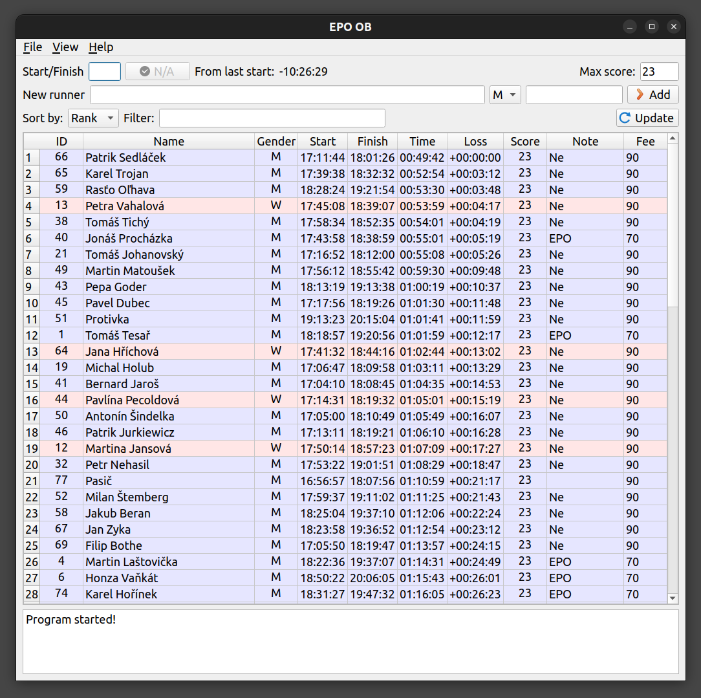
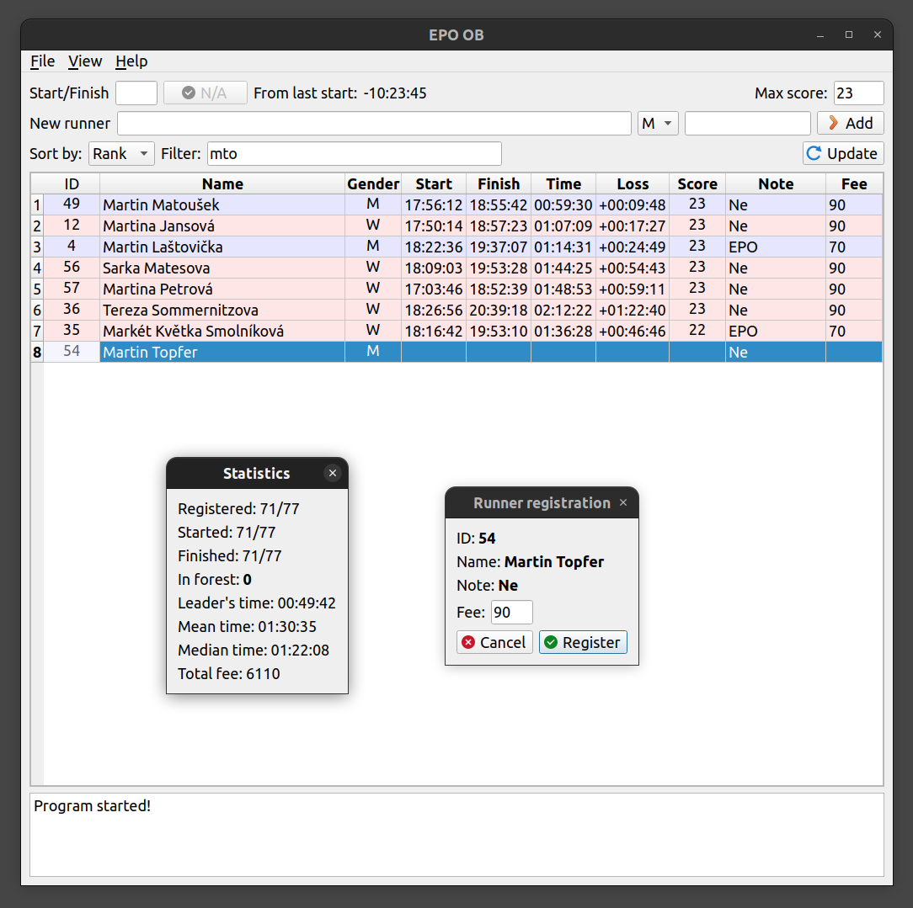
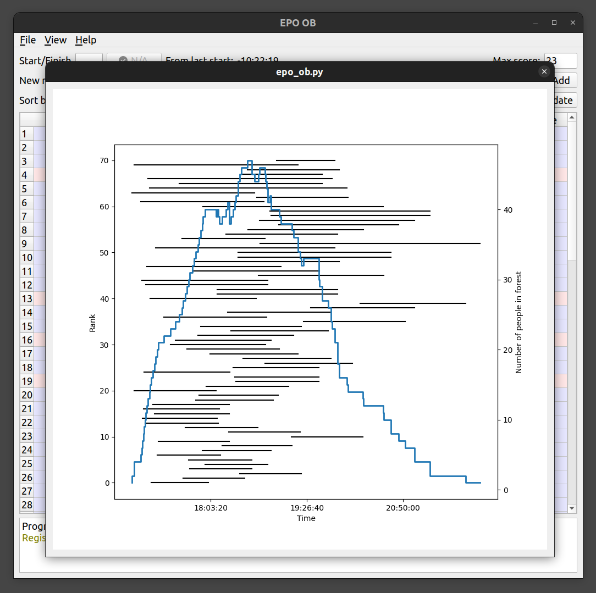

# EPO OB

Application based on `PyQt5` for logging times and scores of EPO runners.

**Idea:** Input is `csv` file which contains at least one column with names called `Names`. This `csv` file is loaded into `pd.DataFrame` which is shown as a table (`QTableWidget`). Any manual change in the table changes entry in the dataframe and table is then completely redrawn (*yes, redraw one line or one cell is faster but requires more coding*). Dataframe is automatically saved as `csv` file after every change.

## Screenshots

## TODO

- Compile app (probably using [**fsb**](https://build-system.fman.io/))
